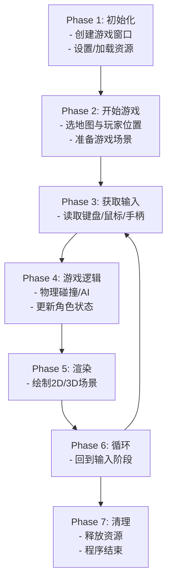
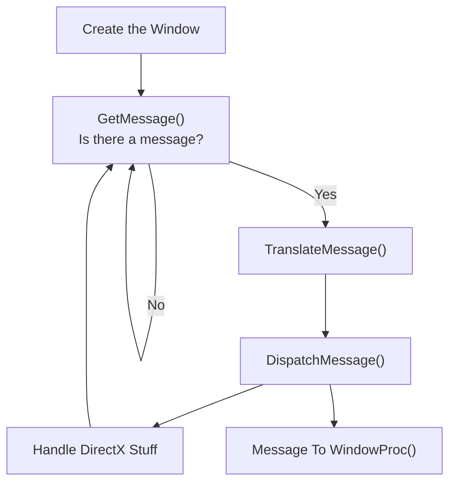
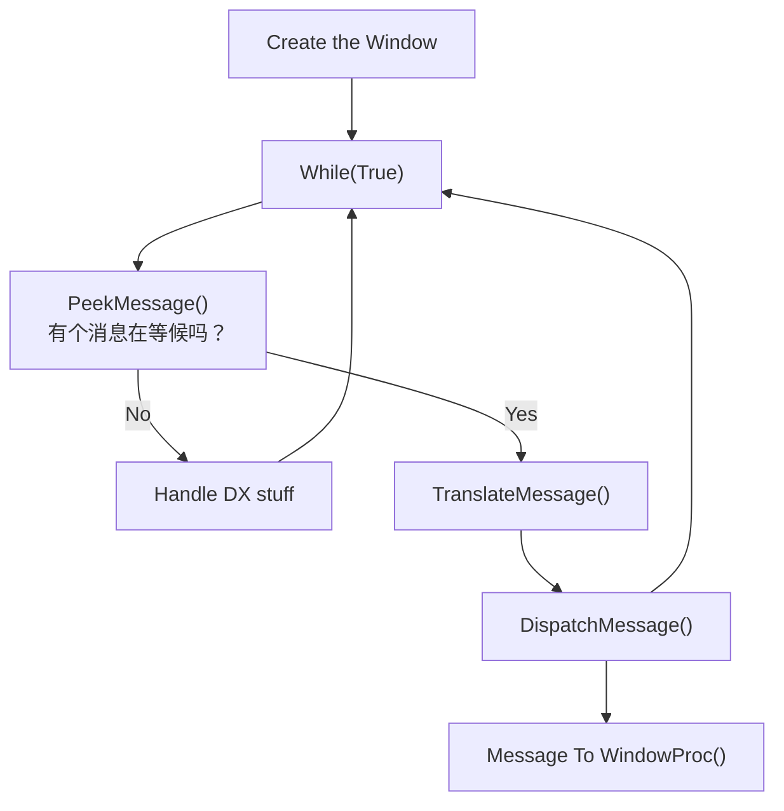
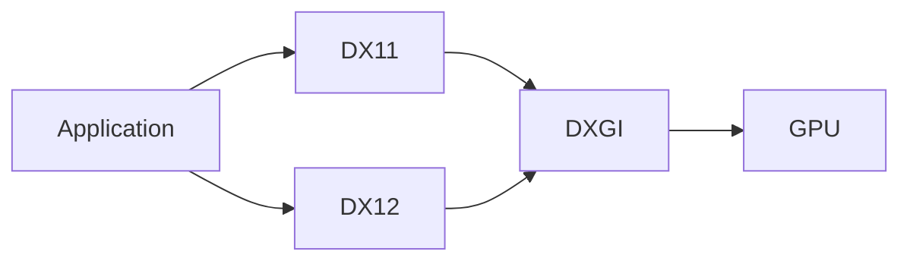

# DirectX学习专案

# 游戏的基本流程



## GitHub学习代码库链接

[https://github.com/VCVina/DirectXLearning](https://github.com/VCVina/DirectXLearning)

<aside>
⚠️

## GitHub小技巧

当出现了如图的Error: GH007: Your push would publish a private email address.该怎么办


1. 这是GitHub的安全机制，所以
`git config --global user.email "{ID}+{username}@users.noreply.github.com"`
2. 重置我们的提交信息在.git所在的那个文件夹
`git commit --amend --reset-author --no-edit`
</aside>

# Win32 控制台程序与 Windows 程序 - WinMain()

请注意，一个简单的控制台程序Console Application 和 真正的Windows程序具有一定的不同。


Visual Studio

1. **控制台程序中，Entry Point只有一个**`main()` ，也是当之无愧的核心函数
    - `main()` 是程序的入口函数，程序从这里开始执行。
    - Windows 会把需要的参数（如命令行参数）传递给 `main()` 函数，但我们暂时不需要关注。
2. **而Windows 程序与控制台程序不同，Windows程序通常由两个核心函数**
    - Windows 程序通常有两个核心函数：
        - 类似于控制台的 `main()`，即 `WinMain()`：这是 Windows 程序的入口点。
        - 另一个专门处理“事件驱动”的函数：用来接收并处理用户在图形界面上的各种输入（如鼠标点击、按键、定时器等），这些操作会被Windows放入消息队列中，再由该函数响应。
    - 本文只会先介绍第一个函数 `WinMain()`，让程序能启动并与 Windows 配合工作；处理事件的函数会在后续内容讲到。
3. 总结，在 **控制台程序** 中，`main()` 是入口点；而在 **Windows GUI 程序** 中，入口点通常是 `WinMain()`。`WinMain()` 会帮助做一些初始化工作，比如创建窗口等。

## WinMain的原型

```cpp
int WINAPI WinMain(
    HINSTANCE hInstance,
    HINSTANCE hPrevInstance,
    LPSTR lpCmdLine,
    int nCmdShow
);

// 因为我擅长Unreal，我们来看看源码的Unreal引擎是怎么写的
// 在Windows环境下，Launcher模块的LaunchWindows.cpp中就存在WinMain
// <UE>\Engine\Source\Runtime\Launch\Private\Windows\LaunchWindows.cpp

int32 WINAPI WinMain(
_In_ HINSTANCE hInInstance, 
_In_opt_ HINSTANCE hPrevInstance, 
_In_ char* pCmdLine, 
_In_ int32 nCmdShow)
// U++自己还实现了_In_开头的这些宏，可以自行去看是什么意思
{
	int32 Result = LaunchWindowsStartup(hInInstance, hPrevInstance, pCmdLine, nCmdShow, nullptr);
	LaunchWindowsShutdown();
	return Result;
}

```

首先可以看到的是API

- WINAPI调用约定
    - WINAPI 是一种传递参数的方法，源自 Fortran 和 Pascal 时代。
    - 简而言之，它的作用是传递参数的顺序。
    - 教程原文：~~简而言之，它的作用是反转传递参数的顺序。它们通常从右向左传递，但使用 WINAPI，它们从左向右传递。为什么这样做的细节并不重要。Windows 只是要求这样做。~~
    - WINAPI 背后的 __stdcall 是从右向左压栈的，和未指定时的 __cdecl 压栈顺序完全一致
    - 为什么这样做的细节并不重要。Windows 只是要求这样做。
    - arm/x64 下就全是 fastcall 优先把参数表从左往右塞寄存器了，但是寄存器塞不下的部分仍然从右向左压栈
        - 在 ARM 和 x64 处理器上，**`__stdcall`**被编译器接受并**忽略**；在 ARM 和 x64 体系结构上，按照惯例，参数在可能的情况下在寄存器中传递，后续参数在堆栈上传递。
        
        [__stdcall](https://learn.microsoft.com/en-us/cpp/cpp/stdcall?view=msvc-170)
        
        - Q：还有什么常用的但是不属于arm/x64的情况吗？
        - A：32位x86程序，这在win11仍然是完整兼容的

<aside>
💡

附加内容：为什么是寄存器？

1. **寄存器**是 CPU 里最快的存储单元，比用栈（内存）快得多。
2. 为了提升效率，部分调用约定会把前几个函数参数直接放到寄存器里（比如 x64 下把前 4 个整型参数分别放在 `RCX, RDX, R8, R9`）。
    1. 到 x64 时代 Windows ABI / Itanium C++ ABI (Linux/BSD) 大家全改用寄存器传参了，一是寄存器变多了不用浪费，二是真的比压栈快。
    2. golang 死命不改的就是传参全部是压栈，这实质上影响着性能发挥，也是造成与 C/C++ 互操作性屌差的原因之一。
3. 一旦参数太多、寄存器不够用，就只能把剩余的参数压到栈里。

</aside>

<aside>
💡

附加内容：“从左往右”还是“从右往左”什么意思？

1. **在栈上传递参数**时，编译器把**第一个参数**先放在栈的那个位置，还是把**最后一个参数**先压到栈顶。
2. 在 32 位 x86 上：**`__cdecl` / `__stdcall`** 都是**从右往左**把参数压到栈里。也就是说，函数原型里最右边的参数先被 `push` 到栈上。
3. 在 64 位（x64）时，大多数主流平台定义了自己的“快速调用约定”也叫`__fastcall`的扩展版，前几个参数直接用寄存器传递，剩余的才走栈。
    1. 寄存器里是左到右还是右到左，这就和具体平台 ABI（应用二进制接口）有关，但对我们平时写 C++ 来说通常不需要手动操心，只需要知道编译器已经帮我们处理好了。
4. 在 x86 平台，`__cdecl` 和 `__stdcall` 在参数传递顺序（右到左）并没有区别，主要差异是谁清理栈：
    1. `__cdecl`：调用者（caller）清理栈。
    2. `__stdcall`：被调用者（callee）清理栈。
5. 而 `__fastcall` 会尽量把参数放到寄存器里，减少栈操作——省时又省空间。
</aside>

随后看一下参数内容

- **HINSTANCE hInstance**
    - **句柄**（handle）是 Windows 用来标识资源或对象的整数 ID。
    - `HINSTANCE` 表示应用程序“实例”的句柄。
    - 由于多任务处理和运行程序的多个副本的能力，Windows 需要一种方法来跟踪哪些程序是哪个——它通过为任何应用程序的每个实例提供一个`HINSTANCE`或一个整数来实现这一点。该整数用于将每个应用程序与其他应用程序区分开来。
    - 当您的程序启动时，Windows 会选择一个数字并将其放入此参数中。这个东西和游戏本体其实关系不大，是操作系统管理资源的行为。
- **HINSTANCE hPrevInstance**
    - 早期 Windows 用来标识「前一个运行实例」的句柄，判断是否已有相同程序在运行。
        - 早在 32 位处理器出现之前和 Windows 95 之前，同一个应用程序的多个副本就被迫共享相同的内存空间。这让事情变得非常复杂，许多程序员都希望防止他们的应用程序运行自己的多个副本。为了避免这种情况，hPrevInstance 会将句柄提供给前一个实例（如果有），如果这是唯一的实例，则返回 NULL，这样程序员就可以检测到任何正在运行的副本。
    - 在现代Windows 32 位及以上系统里，Windows为每个应用程序提供了自己的内存空间，这个参数已经过时，通常都是 `NULL`。
    - 只保留作兼容旧程序，不需要太在意它。
- **LPSTR lpCmdLine**
    - ~~此参数是一个长指针，指向包含调用应用程序的命令行的字符串。~~
        
        LPCTSTR 这玩意的实际类型取决于是否定义了 UNICODE / _UNICODE 宏开关，有的话就实质上是 const wchar_t*，没有就是 const char*，和16位没有关系了。
        
        LP = long pointer，原意确实是16位时代的长指针，但这个习惯一直延续到 32 位乃至以后，就单纯是命名习惯
        
        C = const
        
        T = TCHAR 宏类型
        
    - 比如用户在“运行”窗口里键入
    
    ```cpp
    MyApp.exe RunA
    ```
    
    那么 `lpCmdLine` 中就会有 `"RunA"` 字符串。假如
    
    - 这个参数可以告诉这在游戏编程中很有用，可以运行特殊模式，例如安全模式、窗口模式、软件渲染模式、作弊码模式或任何您想要的模式。
- `int nCmdShow`
    - 控制窗口 **显示状态** 的选项。常见取值包括：
        - `SW_SHOWNORMAL`：正常显示窗口
        - `SW_SHOWMAXIMIZED`：最大化窗口
        - `SW_SHOWMINIMIZED`：最小化窗口
        - …[等等](https://learn.microsoft.com/ja-jp/windows/win32/api/winuser/nf-winuser-showwindow#parameters)
    - 虽然在游戏编程中不一定常用，但有需要时可用来控制窗口的初始显示方式。


我直接在Unreal系统中同样的位置打了断点。
参阅微软的官方文档，SW_SHOWDEFAULT就是`nCmdShow`的10

## Windows 程序与事件驱动

- Windows 程序常常采用 **事件驱动**： 用户的鼠标点击、键盘按下、定时器触发等都会变成一条“消息”放进队列。
- 程序会有另一个函数专门处理这些消息（即“消息循环”），我们会在后面介绍。

> 总结：WinMain() 在 Windows 程序中类似于控制台的 main()，但它多了几个参数来处理 程序实例、命令行、窗口显示状态 等。加上未来我们会学习的事件驱动，构成了 Windows GUI 程序的基本框架。
> 

## 一个真正可以运行的程序

当然，我在这边说明都在用Unreal作为说明，Unreal可不就是真正能运行的程序吗？

所以这样不够，让我们自己来写写看Unreal的雏形——Print一句话吧（迫真

1. 首先，你需要保证你手上的Visual Studio工程文件必须是Windows程序而不是Console程序
    1. 如果你不这么做，会报错：`error LNK2019: unresolved external symbol main referenced in function "int __cdecl invoke_main(void)" (?invoke_main@@YAHXZ)`原因也很简单，因为系统在尝试找main函数但你没有
    2. 在 Visual Studio 中，右击你的项目（.vcxproj）。
    3. 选择 “属性（Properties）”。
    4. 展开 “Linker（链接器）” → “System（系统）”。
    5. 找到 “SubSystem（子系统）” 设置，修改为：`Windows (/SUBSYSTEM:WINDOWS)`


我们书写里面的代码

```cpp
#include <iostream>
#include <windows.h> //<- WinMain

// Q: Can we use booth main func and WinMain func in this Windows application?
// A: Yes, you can. But DON'T DO THIS.

// Entry Point of Program
int WINAPI WinMain(HINSTANCE hInstance,
	HINSTANCE hPrevInstance,
	LPSTR lpCmdLine,
	int nShowCmd)
{
	//  MessageBox() Hello World
	MessageBox(NULL,
		L"Hello World!",
		L"Just another Hello World program!",
		MB_ICONEXCLAMATION | MB_OK);

	//  0 to Windows 
	return 0;
}

```

问题：

1. Windows程序我是否可以只有Main
    1. 不可以，你已经告诉系统这是一个Windows程序了他找不到WinMain就会出现上文的`error LNK2019`，因为在他眼中没有WinMain函数
2. Windows程序我是否可以有Main有WinMain二者
    1. 可同时定义 `main` 和 `WinMain`编译能通过，但系统会根据你项目的子系统设置来决定哪个函数是入口点，比如你设置`Windows (/SUBSYSTEM:WINDOWS)`那么操作系统只会去找并调用 `WinMain`，而 `main` 就不会被自动执行。
3. 在实践中，一般不会同时定义 `main` 和 `WinMain`，因为只有一个会自动执行；想做控制台就用 `main`，想做 GUI 就用 `WinMain`。如果真想都用，就得自己手动在其中一个函数里调用另一个，但是当有这样的需求，please think about your design and don’t do this you bastard.

虽然不是很重要，不过也可以解释一下MessageBox的参数内容

```cpp
int MessageBox（HWND hWnd，
               LPCTSTR lptext，
               LPCTSTR lpcaption，
               UINT utype）；
```

**HWND hWnd**

HWND 是窗口的句柄。正如我们之前所讨论的，句柄是用于标识对象的整数。在本例中，我们标识的是窗口。很简单。因为我们没有创建窗口，所以我们将其设置为 NULL，这样 Windows 就知道此消息不是来自任何窗口，而是来自桌面。

**LPCTSTR lptext**

这是一个指向包含消息框文本的 16 位字符串的指针。仅此而已。

**LPCTSTR lpcaption**

这是一个指向 16 位字符串的指针，该字符串包含消息框的标题栏或标题的文本。很简单。

**UINT utype**

此参数决定消息框的样式。这里是微软的页面，[查询](https://learn.microsoft.com/ja-jp/windows/win32/api/winuser/nf-winuser-messagebox#parameters)可以放入此参数的常用值列表（看前面那个表格，他需要与多个值的逻辑或运算符组合）。

<aside>
💡

依然还是老环节，作为引例，我们看一下Unreal真正的entry point函数是什么样的。

你可以在LaunchWindows.cpp中的WinMain中找到

```cpp
LAUNCH_API int32 LaunchWindowsStartup( HINSTANCE hInInstance, HINSTANCE hPrevInstance, char*, int32 nCmdShow, const TCHAR* CmdLine )
{
//...
}
```

那么能够启动整个如此牛逼如此厉害Unreal Engine系统的启动函数有多长呢？

答案是：104行

唉，软件工程模块化的最强水平，骇死我力，，，

</aside>

# 创建一个窗口（**Window）**吧

还记得上面我们使用了一个MessageWindow吗？

十分遗憾的是，与消息框不同，我们没有可以调用的单个函数来创建窗口。

这有两个原因。

1. 首先，Windows 需要的数据太多，无法进行单个函数调用。
2. 其次，窗口基于事件，需要额外的代码来处理。
    1. 回忆一下啊，事件是发生在窗口上的一些操作，例如单击按钮、调整窗口大小、按下键盘等等。当这些发生时，Windows 会向我们的程序发送一条消息，该消息由 WinProc() 处理。

本课分为三部分。

首先，我们将查看用于创建窗口的代码，

然后，详细查看程序的两个主要部分，了解它们的工作原理以及

最后，了解如何在必要时操作它们

## 给我看看！First Window

作为实例，我们要做的是如下内容

1. 创建窗口
    1. 注册窗口类
    2. 创建窗口类
    3. 展示窗口类
2. 保持窗口运行 - 事件处理

## 注册窗口类

我们将告诉 Windows 根据我们提供的数据创建一个窗口类。

有一个事情很抽象但是必须提一嘴，这里的Windows所谓的窗口类不是C++常规意义上的一个C++ class。

具体如何说明呢？有点微妙，总之你之后发现窗口类好像不是很像一个类

——比如我为啥还要特意Create一个c++ class啊难道不是直接写一个什么public class什么的吗

——的时候就请回忆这句话。

（毕竟人类的词汇还是不够多）

了做到这一点，我们在程序中有以下代码：

```cpp
// 此结构保存有关窗口类的所有info
// WNDCLASSEX 
// https://learn.microsoft.com/ja-jp/windows/win32/api/winuser/ns-winuser-wndclassexw

WNDCLASSEX wc; 
// 顺便说一句，这里的EX表示这是 WNDCLASS 结构的扩展版本，本质上是一样的，但没有一些额外的内容。我们会看到CreateWindowEx() 和 RegisterClassEx() 函数也是如此，有更老、更小的版本没有Ex。
                         
// 清除窗口类以供使用
ZeroMemory(&wc, sizeof(WNDCLASSEX)); 
//ZeroMemory 是一个将整个内存块初始化为 NULL 的函数。
//第一个参数中提供的地址设置了内存块的起始位置。
//第二个参数表示内存块的长度。有了结构体wc的地址和大小，我们可以快速将整个内存块初始化为 NULL。我们将使用它来初始化wc的值。

// 用所需信息填充结构
wc.cbSize = sizeof(WNDCLASSEX); 
// 确定这个结构的大小，并告诉它它的尺寸是多少。我们将使用 sizeof() 运算符来执行此操作。这也算是CPP经典操作了，十分复古，，
wc.style = CS_HREDRAW | CS_VREDRAW; 
// 我们几乎从来不会在游戏编程中使用它们。
// 可以在 MSDN 库可能的值。https://learn.microsoft.com/en-us/windows/win32/winmsg/window-class-styles#constants
// 现在，我们将使用 CS_HREDRAW(如果移动或尺寸调整改变了客户区的宽度，则重新绘制整个窗口)/CS_VREDRAW(如果移动或尺寸调整改变了客户区的高度，则重新绘制整个窗口)。
// Windows 在窗口垂直或水平移动时重新绘制窗口。这对窗口有用，但对游戏可能意义不大。稍后当我们进入全屏游戏时，我们将重置此值。
wc.lpfnWndProc = WindowProc; 
// 这个很重要，我们下面重新说一下
wc.hInstance = hInstance; 
// 我们在上一章节中讲过这个，它是我们应用程序的句柄，只需将Windows传递给我们的值放WinMain()，让window知道自己是哪个应用程序
wc.hCursor = LoadCursor(NULL, IDC_ARROW); 
// 此成员存储窗口类的默认鼠标图像。这是通过使用函数 LoadCursor() 的返回值来完成的，该函数有两个参数。第一个是存储指针图形的应用程序的 hInstance。我们不深入讨论这个，所以我们将其设置为 NULL。第二个是包含默认鼠标指针的值。MSDN 库中的 LoadCursor() 下还有其他值。
wc.hbrBackground = (HBRUSH)COLOR_WINDOW; 
// 此成员包含用于为窗口背景着色的“画笔”。画笔不在本教程的讨论范围内，但在这里用于指示背景颜色。COLOR_WINDOW 表示将窗口涂成白色的画笔（至少对于我的设置而言）。
wc.lpszClassName = L"WindowClass1"; 
// 这是我们正在构建的窗口类的名称。尽管我们只构建一个类，但我们将其命名为“WindowClass1”。您给它起什么名字并不重要，只要您在创建窗口时正确指明即可。

//字符串前面的“L”只是告诉编译器该字符串应该由 16 位 Unicode 字符组成，而不是通常的 8 位 ANSI 字符。

// 注册窗口类
RegisterClassEx(&wc);
```

关于`wc.lpfnWndProc = WindowProc;`这一段的附加说明

1. 是这样的，还记得我们之前说的内容吗下
    1. 窗口的活动大致上都是基于事件的，需要额外的代码来处理。所谓事件，是发生在窗口上的一些操作，例如单击按钮、调整窗口大小、按下键盘等等。
    2. 说白了就是你的动作吧（否则你要一个专门的Window和GUI干什么？）
    3. 当这些发生时，Windows 会向我们的程序发送一条消息，该消息在我们这里就假设由WindowProc()处理。
        
        ```cpp
        LRESULT CALLBACK WindowProc(HWND hWnd, 
                                 UINT message, 
                                 WPARAM wParam, 
                                 LPARAM lParam); 
                                 
        // 这是程序的主要消息处理程序
        LRESULT CALLBACK WindowProc(HWND hWnd, UINT message, WPARAM wParam, LPARAM lParam) 
        { 
            // 排序并找出针对给定消息要运行的代码
            switch(message) 
            { 
                // 在窗口关闭时读取此消息
                case WM_DESTROY: 
                    { 
                        // 完全关闭应用程序
                        PostQuitMessage(0); 
                        return 0; 
                    } break; 
            } 
        
            // 处理 switch 语句未
            return DefWindowProc (hWnd, message, wParam, lParam); 
        }
        ```
        
        1. 当然这个名字取决于你啊！
        2. LRESULT
        - 这是函数的返回类型，表示“**长整型结果**（long result）”。
        - Windows 要求窗口过程（Window Procedure）必须返回一个 `LRESULT`，以表示对消息处理的结果。
        1. CALLBACK
        - 这是一个宏，通常定义为 `__stdcall`，指明 **调用约定**。它告诉编译器该函数如何在底层传递参数和处理返回值。Windows 系统会按这个调用约定来调用你的窗口过程。

## 创建窗口

接下来我们准备好了`WNDCLASSEX wc`就可以用`wc`的内容创建窗口

```cpp
// 原型
HWND CreateWindowExW(
  [in]           DWORD     dwExStyle, // EX
  // https://learn.microsoft.com/en-us/windows/win32/winmsg/extended-window-styles
  [in, optional] LPCWSTR   lpClassName, // 窗口类的名称
  [in, optional] LPCWSTR   lpWindowName,
  [in]           DWORD     dwStyle, 
  // https://learn.microsoft.com/en-us/windows/win32/winmsg/window-styles
  [in]           int       X,
  [in]           int       Y,
  [in]           int       nWidth,
  [in]           int       nHeight,
  [in, optional] HWND      hWndParent,
  [in, optional] HMENU     hMenu,
  [in, optional] HINSTANCE hInstance,
  [in, optional] LPVOID    lpParam
);

// 我们的实现
hWnd = CreateWindowEx(
	NULL, 
	L"WindowClass1", // 窗口类的名称
	L"Our First Windowed Program", // 窗口标题
	WS_OVERLAPPEDWINDOW, // 窗口样式
	300, // 窗口的 x 位置
	300, // 窗口的 y 位置
	500, // 窗口的宽度
	400, // 窗口的高度
	NULL, // 我们没有父窗口, NULL 
	NULL, // 我们不使用菜单, NULL 
	hInstance, // 应用程序句柄
	NULL // 与多个窗口一起使用, NULL
); 
```

**DWORD dwExStyle**

当 `RegisterClass()` 升级为`EX`的 `RegisterClassEx()` 时，添加了第一个参数。它是第四个参数 dwStyle 的扩展，只是为窗口样式添加了更多选项。我们不会在这里介绍它们，但它们可以在 [MSDN 库](https://learn.microsoft.com/en-us/windows/win32/winmsg/extended-window-styles)中找到。我们将此值设置为 NULL 。

**LPCTSTR lpClassName**

这是我们的窗口将使用的类的名称。因为我们只有一个类，所以我们将使用现有的 L"WindowClass1"。此字符串也使用 16 位 Unicode 字符，因此我们在它前面放置了一个L。

**LPCTSTR lpWindowName，**

这是窗口的名称，它将显示在窗口的标题栏中。这也使用 Unicode 所以我们也L一下。

**DWORD dwStyle**

在这里我们可以为窗口定义各种选项。您可以执行诸如删除最小化和最大化按钮、使其不可调整大小、使其具有滚动条以及各种酷炫的功能。同样，这些可以在 [MSDN 库](https://learn.microsoft.com/en-us/windows/win32/winmsg/window-styles)的 CreateWindowEx() 下找到。我们将使用单一值 WS_OVERLAPPEDWINDOW，它是包含其他值的快捷方式，这些值一起构建具有标准功能的基本窗口。

**HWND hWndParent**

这是一个参数，它告诉 Windows 哪个父窗口创建了我们现在要创建的窗口。

父窗口是包含其他窗口的窗口。我们的程序中没有任何父窗口，但举个例子，Microsoft Word 可以在同一窗口中打开多个文档，它由一个父窗口和多个子窗口组成，就是那个意思。

**HMENU hMenu,**

句柄你已经知道了是做什么的。This is just a handle to a menu bar，不过我们没有Menu Bar所以也null。

**LPVOID lpParam**

我们有多个window的时候使用的h，但是我们没有，所以null

关于 `hWnd = CreateWindowEx();` 为什么是 返回值

此函数的返回值是 Windows 将分配给此新窗口的句柄。（这个词真的出现了好多次

我们将它直接存储到我们的 hWnd 变量中，并在下面显示窗口中马上就用到。

## **显示窗口**

这个就比上面简单多了。

```cpp
BOOL ShowWindow(HWND hWnd,
                int nCmdShow);
```

**nCmdShow** 

还记得 WinMain() 中的最后一个参数吗？这就是我们要使用它的地方。

当然，我们不必这样做，但在这种情况下，我们最好让 Windows 告诉我们该做什么。无论是否需要，我们都会将从 nCmdShow 获得的值放在这里，然后就此保留。

<aside>
💡

`FALSE/TRUE`是int类型，而`false/true`是bool类型；所以两者不一样的，只不过

我们在使用中没有这种感觉，因为C++会帮你做隐式转换，但是还是要注意

```cpp
#ifndef FALSE
#define FALSE 0
#endif
#ifndef TRUE
#define TRUE 1
#endif
```

</aside>

## 让窗口保持运行！ Windows 事件和消息 - WinProc类函数（当然名字是你自己定的！）

正如我们之前所讨论的，Windows 编程是基于事件的。这意味着我们的窗口需要在 Windows 给指示时执行某些操作，否则，等待。


事件处理构成了我们程序的另一半，它本身分为两部分：

1. 主循环

```cpp
// 此结构保存 Windows 事件消息
    MSG msg; 
    // 通常不需要直接访问此结构体的内容，但如果您需要，下文有介绍它包含的内容
    // https://learn.microsoft.com/en-us/windows/win32/api/winuser/ns-winuser-msg
    
    

// 等待队列中的下一条消息，将结果存储在“msg”中
// GetMessage() 函数用于将所有消息从消息队列中取出并放入我们的 msg 结构中。它始终返回 TRUE，除非程序即将退出，在这种情况下它返回 FALSE,这样，我们的 while() 循环只会在程序完全完成后才会中断。
    while(GetMessage(&msg, NULL, 0, 0)) 
    { 
// 将某些按键转换为正确格式的函数。我们不会对此进行过多的介绍，因为这一切都是自动完成的
        TranslateMessage(&msg); 
// 它将消息发送到我们的 WindowProc() 函数，我们将在下文中介绍该函数
// 他怎么知道我们的WindowProc？有办法的呀，上文不是有一个wc.lpfnWndProc = WindowProc;吗
        DispatchMessage(&msg); 
    }
```

- GetMessage() 函数有四个参数需要介绍
    - **LPMSG lpMsg**
        - 指向消息结构的指针
        - 只需将结构的地址放在这里即可，就如&msg字面意思
    - **HWND hWnd**
        - 唉依然是h，消息来源窗口的句柄。
        - 但是在此参数中，NULL 表示获取任何窗口的下一条消息。
        - 我们实际上可以在此处输入真正有意义的 hWnd 值——如果我们有多个窗口，则会产生作用。
    - **UINT wMsgFilterMin，UINT wMsgFilterMax**
        - 限制从消息队列中检索的消息类型，有些消息可以不管
        - 有一个相对来说有点难度的运营是这样的，[例如](https://learn.microsoft.com/en-us/previous-versions/windows/embedded/aa453874(v=msdn.10))
            
            ```cpp
            wMsgFilterMin = WM_KEYFIRST
            wMsgFilterMax = WM_KEYLAST 
            ```
            
        - 用“0”填充这两个值，则 GetMessage() 会假定您想要收集任何消息，无论其值如何。我们可以在程序中这样做。
- 思考问题：`while(GetMessage(&msg, hWnd /*NotNULL*/,  0, 0))` 的时候，会有什么问题
    - 如果写的是hWnd，你的 `GetMessage(&msg, hWnd, 0, 0)` 只会获取与 **`hWnd`** 这个窗口句柄关联的消息（比如 `WM_DESTROY`、`WM_PAINT` 等）。因为 `WM_QUIT` 没有与任何窗口句柄关联，所以这种用法就 **无法**取到 `WM_QUIT`。
    - `GetMessage(&msg, NULL, 0, 0)`才是获取 **整个线程消息队列** 中的所有消息。 `WM_QUIT` 是线程级消息，**并不**属于某个特定窗口，因此和 `hWnd` 无关。所以，如果你的 `GetMessage` 只取 `hWnd` 相关的消息 (`GetMessage(&msg, hWnd, 0, 0)`)，就永远接收不到 `WM_QUIT`，导致循环无法退出。
    - 通常做 Win32 窗口循环时，除非确实想过滤到特定窗口，否则一般写 `NULL`，让它获取当前线程的所有消息。

2. WindowProc() 函数

```cpp
// sort through and find what code to run for the message given
    switch(message)
    {
        // this message is read when the window is closed
        case WM_DESTROY:
            {
                // close the application entirely
                PostQuitMessage(0);
                return 0;
                // 这非常重要，因为它告诉 Windows 我们已处理该消息。
            } break;
    }

    // Handle any messages the switch statement didn't
    return DefWindowProc (hWnd, message, wParam, lParam);
```

- **WindowProc() 是一个处理窗口消息的函数。**
- 当 `DispatchMessage()` 被调用后，会把消息派发给 `WindowProc()`。
- `WindowProc()` 通过参数 `message` (`uMsg`) 判断是什么消息，然后使用 `switch` 语句来分发处理。
    - 当窗口即将被销毁时**`WM_DESTROY`**会被发送到消息队列里。`WM_DESTROY`等消息被称为[Window Notifications](https://learn.microsoft.com/en-us/windows/win32/winmsg/window-notifications)
    - 如果回想一下主循环，会记得 `GetMessage()` 函数仅在程序即将退出时返回 FALSE？
    - 而这其实就是`PostQuitMessage(0);`时：当 `WindowProc()` 里调用 `PostQuitMessage(0)` 时，系统会向消息队列里添加一个 `WM_QUIT` ，而`GetMessage()` 函数发现了`WM_QUIT`就会返回FALSE，因此，此函数基本上的作用是告诉我们的程序正确完成 WinMain() 函数。
    - 接下来我们case的`return 0`意味着“我们不需要再交给系统做别的默认处理了，这条消息就到此结束”。
        - 如果你不写 `return 0`（而直接 `break` 或调用 `DefWindowProc`），系统会执行它的默认行为。
        - 因为我们明确发出了 `WM_QUIT` 的退出消息并自定义了处理逻辑，所以“返回 0”更合理，表明“**处理完成**”。
        - 所有我们未处理的消息，最后都交给 `DefWindowProc()` 来处理，以确保 Windows 的默认行为正常执行。

## 总结一下

为了实现这个功能，我们的软件大概如何？主要是三大模块

1. 注册窗口类
    1. 我们需要一个窗口类，里面藏着所有需要的数据，wc
    2. 我们初始化wc中的成员，并且Register，表示这个窗口类我们需要使用
    3. 这个函数一定发生在哪里？当然是Entry Point的第一块
    4. 基于一个良好的习惯，你可以进行模块化（虽然似乎这么简单的程序没有什么意义……）
2. 创建窗口类
    1. 我们需要使用wc开始创建窗口，这个十分简单，只需要使用wc就好了
    2. 这个函数一定发生在哪里？当然是Entry Point的第二块
3. 让窗口保持侦听事件并运行！
    1. WindowsProc类的事件处理函数
    2. 这个函数一定发生在哪里？当然是Entry Point的第三块
    3. 只是WindowsProc类的事件处理函数我们需要在cpp的其他地方额外定义

然后加上一点软件工程的优化（增加头文件，逻辑函数化等等），最终实现了这个程序

[DirectXLearning.h](DirectX%E5%AD%A6%E4%B9%A0%E4%B8%93%E6%A1%88%201bc9a30d1a718069b70dc0559ae6137d/DirectXLearning%20h%201bc9a30d1a71804db7abc69d88787826.md)

[DirectXLearning.cpp](DirectX%E5%AD%A6%E4%B9%A0%E4%B8%93%E6%A1%88%201bc9a30d1a718069b70dc0559ae6137d/DirectXLearning%20cpp%201bc9a30d1a71801c9b3fdcf110245505.md)

# **实时消息循环 PeekMessage()/GetMessage()**

## GetMessage() 循环的问题



GetMessage() 等待消息，并在收到消息后将其发送到下一步，TranslateMessage()。

这对于 Windows 编程来说非常合乎逻辑，因为一般来说，Windows 应用程序（例如 Word）倾向于静止不动直到采取行动，但是游戏不是这样的。

在等待窗口指令过程中，我们需要每秒创建 30 到 60 个完全渲染的 3D 图像，并将它们毫不延迟地显示在屏幕上。因此，我们面临一个相当有趣的问题，因为我们考虑正常情况， Windows 发送任何消息时，绝对不会每秒发送 30 个——这很不科学吧，说白了就是，在游戏中，停等窗口事件是不科学的。



## 使用 PeekMessage() 以后我们该如何修改

我们将用新函数 PeekMessage() 替换当前的 GetMessage() 函数。此函数本质上执行相同的操作，但有一个重要区别：它不等待任何操作。PeekMessage() 只是查看消息队列并检查是否有任何消息在等待。

如果没有，程序也将继续运行（不停等！！！）让我们可以执行所需的操作。

```cpp
BOOL PeekMessage（LPMSG lpMsg，
                 HWND hWnd，
                 UINT wMsgFilterMin，
                 UINT wMsgFilterMax，
                 UINT wRemoveMsg）；
```

前四个参数与 `GetMessage()` 的四个参数相同。

然而，第五个参数 `wRemoveMsg` 是新的。

- 指示从队列中检索到的消息是否应保留在事件队列中或删除。
    - `PM_REMOVE`：读取消息时将其从队列中删除
    - `PM_NOREMOVE`：将消息保留在那里以供以后检索。

我们将在这里使用 `PM_REMOVE`。

我们这里改进的代码

```cpp
while (TRUE) { 
		// Code for every frame
		if (PeekMessage(&msg, NULL, 0, 0, PM_REMOVE))
		{
			TranslateMessage(&msg);
			DispatchMessage(&msg); //->wc.lpfnWndProc = WindowProc, We need complete this WindowProc

			// Quit?
			if (msg.message == WM_QUIT)
				break;
		}
	}
```

`msg.message == WM_QUIT`

如果我们的消息是 `WM_QUIT`，则意味着是时候退出“无限”循环并返回 Windows 了。

但原本是没有的。

```cpp
while(GetMessage(&msg, NULL, 0, 0)) 
    { 
        TranslateMessage(&msg); 
        DispatchMessage(&msg); 
    }
```

那是因为原本`while`我们的条件就是取决于`WM_QUIT`的时候`GetMessage`返回`false`，而现在的`while`直接是`TRUE`，因此我们要手动Break。

# **窗口大小和客户端（Client）大小**

当我们调用 CreateWindowEx() 时，我们使用 500 和 400 来设置窗口的大小。

然而，这与**客户端**的大小不同。客户端区域是窗口不包括其边框的部分。


渲染时，我们只会在窗口的客户端区域上进行绘制。因此，了解其确切大小非常重要。

## 客户端大小为什么重要？

使用 Direct3D 绘图时，系统会要求您指定要生成的图像的大小。

如果窗口的客户端与此图像的大小不同，则图像会被拉伸或缩小以适合客户区。

基于此，我们理想顺序是：

1. 确定客户端大小
2. 计算适当的窗口大小

而不是先设置窗口大小然后再确定客户端大小。

为此，我们将在创建窗口之前使用 AdjustWindowRect() 函数

```cpp
BOOL AdjustWindowRect（LPRECT lpRect，
                      DWORD dwStyle，
                      BOOL bMenu）；
```

**LPRECT lpRect**

指向 RECT 结构体的指针。指向的 RECT 包含所需Client的坐标。

调用该函数时，RECT 会被修改为包含窗口区域的坐标。

BOOL bMenu

我们是否正在使用菜单。从技术上讲，菜单不是客户区的一部分，因此必须考虑到这一点。

**注意，DirectX的坐标是右下角最大**

这个函数如何使用不如直接看code是如何做到的。我们修改一下上一节所使用的代码

```cpp
RECT wr = {0, 0, 500, 400}; // 设置大小，但不设置位置
AdjustWindowRect(&wr, WS_OVERLAPPEDWINDOW, FALSE); // 调整大小

// 创建窗口并使用结果作为句柄
hWnd = CreateWindowEx(NULL, wc.lpszClassName, L"Our First Windowed Program", WS_OVERLAPPEDWINDOW, 
		300, // x 
		300, // y 
		wr.right - wr.left, // w
		wr.bottom - wr.top, // h
		NULL, 
		NULL,
		hInstance, // handle from windows
		NULL
	);
// 注意，DirectX的坐标是右下角最大
```

# **DX第一课：理解图形概念**

Direct3D 与其说是一个游戏平台，不如说是一个硬件接口。您在 Direct3D 中所做的一切都是为了操纵图形硬件（一般来说，就是GPU）本身。如果不了解图形硬件，Direct3D 几乎毫无用处。

<aside>
💡

DirectX被广泛用于Microsoft Windows、Microsoft Xbox电子游戏开发，并且只能支持这些平台。  **Direct3D是DirectX中最广为应用的子模块（图形API），所以有时候这两个名词可以互相代称**

</aside>

## DirectX Graphics Infrastructure - DXGI

DXGI 实际上并不是 Direct3D 的一部分。它是 Direct3D API和其他图形组件的基础，并充当 Direct3D 与硬件之间的接口。



## 交换链 The Swap Chain

GPU 的内存中包含一个指向像素前台缓冲区的指针，该缓冲区包含当前屏幕上显示的图像（下文的front Buffer）。

- 当需要渲染某些内容时，GPU 会更新此数组并将信息发送到显示器进行显示。
- 然后，显示器**从上到下重新绘制屏幕**，用新图像替换旧图像。

**为何会使用像素缓冲区（back buffer）**

请思考一个问题，如果没有一个缓冲区，我们直接把渲染的像素绘制在显示器上，那么，在显示器绘制一半的时候，突然需要渲染的画面画面变化了怎么办？？

显示器的刷新速度无法满足实时渲染的需求，在显示器刷新时将另一个图像渲染到 GPU，则显示的图像将被切成两半，顶部包含旧图像，底部包含新图像。这种效果称为撕裂（tearing）。

为了避免这种情况，DXGI 实现了一项称为*交换*的功能。


DXGI 不会将新图像直接渲染到显示器上，而是

1. front buffer将是当前正在显示的缓冲区
2. 将图像绘制到**back buffer**上。
3. **back buffer绘制**完成后，DXGI 将使用back的内容更新front，并丢弃旧的front。
    1. 更新并不是依靠拷贝什么的，不可以这样，因为GPU 比显示器快得多
    2. DXGI 为每个缓冲区（前缓冲区和后缓冲区）分别使用一个指针，并简单地切换它们的值。后缓冲区会变为前缓冲区（反之亦然），并且不会发生撕裂。
4. 有些时候，还可以添加额外的Additional back buffers（123分别是指针）
    
    
    

## 渲染管线 Rendering Pipeline


一个虚幻引擎的真实抓帧例子，来自LumenSceneUpdate其中可以看到IA，VS，PS，OM


一个虚幻引擎的真实抓帧例子，来自LumenReflections其中可以看到计算着色器CS

](DirectX%E5%AD%A6%E4%B9%A0%E4%B8%93%E6%A1%88%201bc9a30d1a718069b70dc0559ae6137d/image%2010.png)

DX11环境下的[Rendering Pipeline](https://learn.microsoft.com/en-us/windows/win32/direct3d11/overviews-direct3d-11-graphics-pipeline)

](DirectX%E5%AD%A6%E4%B9%A0%E4%B8%93%E6%A1%88%201bc9a30d1a718069b70dc0559ae6137d/image%2011.png)

DX12环境下（UE5）的[Rendering Pipeline](https://learn.microsoft.com/en-us/windows/win32/direct3d12/pipelines-and-shaders-with-directx-12)

我们需要关注的主要几个阶段（暂时）

1. `IA` 输入组装
    1. 是管道的第一步。它的职责可以说是“咀嚼食物”。它从VRAM中收集有关要渲染的 3D 模型的信息。然后，它会编译这些信息并准备进行渲染。
2. `VS`顶点着色器
    1. 我们很少会使用到它，不过 Unreal 里面也是有例子可以看到的。
    2. `BasePassVertexShader.usf`可以参考，Base pass 就是 Unreal 将所有网格（包括景观、骨架网格等）绘制到 `GBuffer` 的通道。
3. *光栅化*阶段（Rasterizer）
    1. 负责确定在 Back Buffer 上绘制图像的位置，或者更具体地说，要绘制哪些精确的像素以及它们将是什么颜色。
4. `PS`像素着色器
    
    
    ## UE的着色器编程101
    
    ```cpp
    //首先这是只要补充少量代码就可编译可运行的一段伪代码，作为教科书是我们的解析对象
    
    class FCopyCS : public FGlobalShader {
    	DECLARE_GLOBAL_SHADER(FCopyCS );
    	SHADER_USE_PARAMETER_STRUCT(FCopyCS,FGlobalShader);
    	BEGIN_SHADER_PARAMETER_STRUCT(FParameters, )
    		SHADER_PARAMETER_STRUCT_REF(FViewUniformShaderParameters, View)
    		SHADER_PARAMETER_SAMPLER(SamplerState, Sampler)
    		//...
    		SHADER_PARAMETER_RDG_TEXTURE_UAV(RWTexture2D, OutXXXRT ) //请注意看这个输出格式，是RWTexture2D，我们可以将UAV绑定在这里作为输出的RenderTarget
    	END_SHADER_PARAMETER_STRUCT()
    	
    public:
    	static bool ShouldCompilePermutation(const FGlobalShaderPermutationParameters& Parameters) { return true; }
    	static void ModifyCompilationEnvironment(const FGlobalShaderPermutationParameters& Parameters, FShaderCompilerEnvironment& OutEnvironment){ }
    };
    	
    IMPLEMENT_GLOBAL_SHADER(FCopyCS, "/Plugin/.../Private/XXX.usf", "MainCS", SF_Compute);
    
    //↑ 着色器初始定义
    
    //这是某个渲染线程函数内部，假设这是某SceneViewExtension的PrePostProcessPass_RenderThread
    {
    FCopyCS::FParameters* SCParams = GraphBuilder.AllocParameters<FCopyCS::FParameters>();//创建参数组
    TShaderMapRef<FCopyCS> TestShader = GetGlobalShaderMap(GMaxRHIFeatureLevel);
    
    FRDGTextureRef dstFullTexture = GraphBuilder.CreateTexture(
    	FRDGTextureDesc::Create2D(
    		FIntPoint(srcSize.X, srcSize.Y),//Full resolution
    		dstFinalTexture->Desc.Format,//Format is same as dstFinalTexture
    		FClearValueBinding::BlackMaxAlpha,
    		ETextureCreateFlags::ShaderResource | ETextureCreateFlags::UAV//这是一个标记，目的是声明这个Texture允许被UAV和SRV访问
    	),
    	TEXT("Temp Buffer")
    );
    
    FRDGTextureUAVRef dstUAV = GraphBuilder.CreateUAV(FRDGTextureUAVDesc(dstFullTexture));
    
    SCParams->OutSceneRT = dstUAV;
    
    GraphBuilder.AddPass(
    			RDG_EVENT_NAME("Test Shader"),
    			SCParams,
    			ERDGPassFlags::Compute,
    			[SCParams, TestShader, Resolution](FRHICommandList& RHICmdList)
    			{
    				const FIntVector GroupCount = FComputeShaderUtils::GetGroupCount(FIntPoint(Resolution, Resolution), FIntPoint(8, 8)); //[numthreads(8, 8, 1)]
    				FComputeShaderUtils::Dispatch(RHICmdList, TestShader , *SCParams, GroupCount);
    			}
    		);
    }
    
    ```
    
    首先是准备参数组
    
    ```cpp
    //
    class FCopyCS : public FGlobalShader {...}
    
    //某个函数需要开始使用这个名为FCopyCS着色器
    FCopyCS::FParameters* Params = GraphBuilder.AllocParameters<FCopyCS::FParameters>();//创建参数组
    TShaderMapRef<FCopyCS> TestShader = GetGlobalShaderMap(GMaxRHIFeatureLevel);
    
    ```
    
    随后，我们开始准备资源
    
    ```cpp
    FRDGTextureRef TextureRef = GraphBuilder.CreateTexture(
    	FRDGTextureDesc::Create2D(
    		...,
    		...,
    		...,
    		ETextureCreateFlags::ShaderResource | ETextureCreateFlags::UAV
    		//←这是一个标记，目的是声明这个Texture允许被UAV和SRV访问，我这个Texture能支持两种窗口
    		
    	),
    	TEXT("Temp Buffer")
    );
    ```
    
    在UE的渲染图（RDG）中，我们用FRDGTextureDesc创建Texture资源的时候，需要用到的参数都是被FRDGTextureDesc类包装的。
    
    看到Desc就知道这是一个描述，Description，这很像参数组，我们可以用这个类捆包一系列【大小】等用来创建FRDGTexture的各种参数，自然也包括是否会被SRV和UAV标记。
    
    **FRDGTextureDesc**：
    
    - “描述”一个纹理应有的各种属性，比如大小、格式、Mip 级别、是否是渲染目标、是SRV还是UAV？等等。意思就是，我要创建一个贴图，可我要创建什么样的贴图？
    - 就像一份【配置清单】，先把这个纹理要怎么创建、有哪些特性写清楚。
    
    > 如何理解SRV和UAV？
    > 
    
    在C++层面理解图形编程，需要理解两个概念：数据资源本身，和，访问资源的方法（Viewer）。
    
    有的Viewer可以读，例如SRV。
    
    有的Viewer可以写，例如UAV。为何要这么做？因为详细来说，其实系统如何修改、如何访问资源是有所限制的，但是详情不需要写在这里。
    
    这两个V（viewer）其实就是两个窗口，假设Texture资源放在窗口后面，UE希望你要通过UAV去访问这些Texture，而不是直接伸手去改（这是强制的，因为UE底层保障了很多东西防止用户手贱）
    
    因此为了让我们能访问创建好的Texture，我们在创建的时候需要告诉他，这个资源我希望被SRV和UAV访问！
    
    ```cpp
    ETextureCreateFlags::ShaderResource | ETextureCreateFlags::UAV
    // | ETextureCreateFlags::RenderTargetable 
    ```
    
    ————————
    
    > RenderTargetable 和 UAV 是两件不一样的事情：RT是调起图形管线作为输出的对象，UAV的意思是Compute Shader能读能写。
    > 
    
    ↑作为引例，其实ETextureCreateFlags下面也有一个flag叫做RenderTargetable，告诉系统这个Texture可以被RT化！才能被绑定到像素着色器的末尾，以及，才能被SetRenderTarget。
    
    为了理解这件事，在虚幻引擎源码中，可以参考AddDrawTexturePass
    
    ```cpp
    
    // 请参考虚幻引擎的源代码，我使用的版本是5.5
    
    void AddDrawTexturePass(
    	FRDGBuilder& GraphBuilder,
    	const FSceneView& View,
    	FRDGTextureRef InputTexture,
    	FRDGTextureRef OutputTexture,
    	FIntPoint InputPosition,
    	FIntPoint InputSize,
    	FIntPoint OutputPosition,
    	FIntPoint OutputSize)
    {
    	//...
    	Parameters->InputTexture = InputTexture;
    	Parameters->InputSampler = TStaticSamplerState<>::GetRHI();
    	Parameters->RenderTargets[0] = FRenderTargetBinding(OutputTexture, LoadAction);
    	//PS中常见的SV_Target0 其实就是在这个地方绑定上去的
    	//如果这里的FRDGTextureRef InputTexture没有被标记过RTable，那么无法通过编译，报错Attempted to create UAV from texture %s which was not created with TexCreate_UAV
    	AddDrawScreenPass(GraphBuilder, RDG_EVENT_NAME("DrawTexture"), View, OutputViewport, InputViewport, PixelShader, Parameters);
    }
    ```
    
    如此，一个纹理资源就被创建好了。
    
    ————————
    
    由于我们已经标记了这个Texture是UAV可访问的，所以我们可以基于其创建一个访问这个Texture读写的窗口了。
    
    ```cpp
    FRDGTextureUAVRef dstUAV = GraphBuilder.CreateUAV(FRDGTextureUAVDesc(TextureRef));//创建了一个UAV窗口，用来访问这个Texture的内容
    
    Params ->OutXXXRT = dstUAV;//还记得着色器的输入参数RWTexture2D吗？这个viewer就可以绑定上去。
    
    ```
    
    **FRDGTextureRef和FRDGTextureUAVRef的区别是什么？**
    
    在我的实践中，
    
    ```cpp
    FRDGTextureUAVRef UAV = GraphBuilder.CreateUAV(FRDGTextureUAVDesc(/*FRDGTextureRef*/Texture));
    ```
    
    这个代码就足够理清：我拥有一个对Texture资源的引用，现在我可以用它获得一个访问该资源的窗口的引用了。
    
    接下来我们就可以创建一个渲染Pass，这个
    
    ```cpp
    GraphBuilder.AddPass(
    			RDG_EVENT_NAME("test Shader"),
    			SCParams,
    			ERDGPassFlags::Compute,
    			[Params, TestShader, Resolution](FRHICommandList& RHICmdList)//传递进pass的参数当然要包括参数组Params, 这个着色器, 以及其他的数据，比如我这个例子里，我需要用到分辨率，所以自然还得传递
    			{
    				const FIntVector GroupCount = FComputeShaderUtils::GetGroupCount(FIntPoint(Resolution, Resolution), FIntPoint(8, 8)); //[numthreads(8, 8, 1)]
    				FComputeShaderUtils::Dispatch(RHICmdList, TestShader, *Params, GroupCount);
    			}
    		);
    ```
    
    当这个着色器跑完，dstUAV对应的帧就被修改了，到此，这一帧的这一部分的着色器逻辑就结束了。
    
    > 着色器内：DX标准像素着色器的图形管线和计算管线
    > 
    - 图形管线
    
    首先，我这个例子用的是计算着色器，不过，在最标准的dx11渲染管线下，一个Pixel Shader的管线输出必须会有一个输出目标（Compute Shader是可以没有对应输出贴图的）。
    
    一个允许作为渲染目标的Texture就是Render Target，一个Pixel Shader的return的输出就是那张贴图的对应像素，只不过，我们把它用于“渲染输出”或“渲染目标”时，就会称它为 “Render Target”，RT的本质其实就是会被用来输出的Texture。
    
    ```cpp
    //下面这个代码为虚幻引擎自己的着色器代码，在虚幻引擎中PS结尾的都是Pixel Shader
    
    // Copyright Epic Games, Inc. All Rights Reserved.
    
    /*=============================================================================
    	CopyDepthTexture.usf
    =============================================================================*/
    
    #include "Common.ush"
    
    #if MSAA_SAMPLE_COUNT > 1
    Texture2DMS<float, MSAA_SAMPLE_COUNT> DepthTextureMS;
    #else
    Texture2D<float> DepthTexture;
    #endif
    
    // SV_XXX的意思是 System-Value Semantics 告诉系统这个参数是什么。
    // 其他的SV_可以参考 https://learn.microsoft.com/en-us/windows/win32/direct3dhlsl/dx-graphics-hlsl-semantics#system-value-semantics
    
    float CopyDepthPS(
    	float4 Position : SV_POSITION 
    #if MSAA_SAMPLE_COUNT > 1
    	, uint SampleIndex : SV_SampleIndex
    #endif
    ) : SV_DEPTH
    {
    #if MSAA_SAMPLE_COUNT > 1
    	return DepthTextureMS.Load(int2(Position.xy), SampleIndex).x;
    #else
    	return DepthTexture.Load(int3(Position.xy, 0)).x;
    #endif
    }
    ```
    
    
    
    PIX For Windows 抓帧中，我们可以通过Pipeline State看到RenderTarget0中存在资源
    
    - 计算管线（Compute Shader，CS）
    
    CS也是要发起Drawcall的，但是它不访问RenderTarget。
    
    ```cpp
    //在C++中，我们写了Params->OutXXXRT = dstUAV;
    //我们不是把资源直接挂上去，而是把UAV这个窗口给了着色器，通过UAV修改这个资源
    
    //假设我现在临时写一个着色器需要用到他。UE的计算着色器是CS结尾。
    
    //　アウトプット
    RWTexture2D<float4> OutXXXRT;
    
    [numthreads(8, 8, 1)]
    //一个Group是8*8 = 64个线程。
    //我发起了279*279个Group，请参加下图，PIX可以看到Group组数量
    //每一个线程都在并行执行MainCS
    void MainCS(uint3 DispatchThreadId : SV_DispatchThreadID)
    //SV已经解释过了，这里是告诉系统我们这个ID是DispatchThreadID
    {
        const uint2 InputCoord = DispatchThreadId.xy;
        if (InputCoord.x >= srcSizeX
        || InputCoord.y >= srcSizeY)
        {
            return;
        }
        OutXXXRT[InputCoord] = SampleColor(InputCoord);
    }
    ```
    
    
    
    线程数量在这里可以看到
    
    因为没有RenderTarget这个东西了，所以我要输入一个可读可写的Texture2D承接CS的输出，那么就如同这个代码，我先在C++中OutXXXRT = dstUAV; 在CS中对RWTexture2D<float4> OutXXXRT;进行操作。
    
5. `OM` 输出合并阶段
    1. 管道中的最后一步。它的作用是将各个模型图像合并为一个整体图像，并将该图像正确放置在Back Buffer中。

## 3D 几何体

由于三角形在创建 3D 模型时非常有用，因此 Direct3D 的设计完全围绕三角形，并将三角形组合起来形成形状。要构建三角形，我们使用一种称为顶点的东西。

1. 顶点 Vertices ：DX定义的顶点当然不只是一个三维坐标，它其实是「3D 空间中精确点的**位置**和**属性**」的一个结构体。
2. 基元 Primitives （图元）：
    1. 点列表：顶点的list
        
        
        
    2. 线列表**Line Lists**：每个奇数顶点和下一个顶点之间创建单独的线段的list
        
        
        
    3. 线带Line Strips：similar to a line list, 只是和线列表不同，带中所有的顶点都被线段连接起来了，不中断
        
        
        
    4. 三角列表：是一个列表，其中每一个元素（组）中的三个顶点都是一个三角形
        
        
        
    5. 三角带（Triangle Strips）：和线带类似，一系列顶点组成的，但**相互连接**的三角形
        1. 它的数据比较特殊，是**前三个顶点创建一个三角形，之后每个顶点都会根据前两个顶点创建一个额外的三角形**。
        
        
        

1. 基元绘制的小怪癖（**Quirk**）
    1. 在绘制图元时，渲染管线有一个小偷懒的地方，就是图元只显示一侧。
        
        
        
        只有当三角形图元的顶点按顺时针顺序排列时，才会绘制三角形图元。如果将其翻转，则三角形图元会变成逆时针方向，因此不会显示。
        
    2. 虽然是有方法可以显示两侧的，但通常模型是完全封闭的无法看到其内部。
    3. 如果模型完全封闭，则只需绘制每个三角形的一侧，毕竟很好想到，绘制图元的两侧将花费两倍的时间（但不是做不到）

# 初始化D3D **Initializing Direct3D**

## Microsoft 组件对象模型 (COM)

1. DirectX 是一系列 COM 对象，其中之一就是 Direct3D。
2. Direct3D 是一个 COM 对象，其中包含其他 COM 对象。
3. 最终，它包含使用软件、硬件或任何软件运行 2D 和 3D 图形所需的一切。

由于 Direct3D 已经存储在类中，所以当您看到 Direct3D 函数被这样调用时，请不要感到惊讶：

```cpp
device->CreateRenderTargetView()

device->Release()
```

尽管 COM 的任务是隐藏所有的复杂性，但您仍然需要了解四件事。

1. COM对象是由接口（interface）控制的一组类。接口是一组函数，用于控制 COM 对象。在上面的例子中，“Device”是一个 COM 对象，函数控制它。
2. 每种类型的 COM 对象都有唯一的 ID。例如 Direct3D 对象有自己的 ID，DirectSound 对象有自己的 ID。有时你需要在代码中使用此 ID。
3. **使用完 COM 对象后，必须调用 Release() 函数。这将告诉对象释放其内存并关闭其线程。**
4. COM对象很容易识别，因为它们通常以“I”开头，例如“ID3D10Device”。毕竟都是由接口控制的。。。

## Direct3D头文件和基础编程

```cpp
#include <d3d11.h> 
#include <d3dx11.h> 
// 多了一个x是为什么？
// d3d11.h 文件包含 Direct3D 的核心部分，而多了个X的d3dx11.h 文件包含 Direct3D 的扩展，这些扩展对于图形库来说不是必需的，但在编写游戏或其他图形程序时非常有用。
#include <d3dx10.h> 
// Direct3D 11 实际上是 Direct3D 10 的扩展。因此，它借用了 Direct3D 10 中的许多宏、函数和类。此标头允许我们在程序中使用这些。

// include the Direct3D Library file
#pragma comment (lib, "d3d11.lib")
#pragma comment (lib, "d3dx11.lib")
#pragma comment (lib, "d3dx10.lib")
```

<aside>
⚠️

并非所有编译器都会自动找到这些文件。

在某些情况下，您需要设置项目以查找 DirectX SDK 的文件夹。

如果使用的是 Visual Studio，[在这里](http://www.directxtutorial.com/lessonarticle.aspx?id=4)编写了一个关于如何执行此操作的快速迷你课程。

</aside>

**#pragma comment (lib, "d3d11.lib")**

**#pragma comment (lib, "d3dx11.lib")**

**#pragma comment (lib, "d3dx10.lib")**

关联资料：

[注释 pragma](https://learn.microsoft.com/zh-cn/cpp/preprocessor/comment-c-cpp?view=msvc-170)

它告诉编译器 **自动链接指定的库文件**，相当于手动在项目设置里添加依赖库。在 **Windows 的 DirectX** 开发中，我们用到了 `d3d11.lib`, `d3dx11.lib`, `d3dx10.lib` 这些库文件。但是 **库文件本身不会自动链接**，如果不手动指定，编译时会出现 **未定义的符号（unresolved external symbol）** 错误，比如：

```cpp
error LNK2019: unresolved external symbol _D3D11CreateDevice@...
```

使用 `#pragma comment(lib, "xxx.lib")` 就能让编译器自动帮我们加上这些库文件，避免手动配置。

手动在 **Visual Studio** 项目设置添加依赖库也是可以的

1. **右键**你的项目 → 选择 **Properties（属性）**
2. 进入 **Linker（链接器）** → **Input（输入）**
3. 在 **Additional Dependencies（附加依赖项）** 里添加：
    
    ```
    d3d11.lib
    d3dx11.lib
    d3dx10.lib
    ```
    
4. 点击 **Apply** 并 **OK**，然后重新编译。

所以 `#pragma comment(lib, "xxx.lib")` 只是一个快捷方式，让你不用手动设置，直接在代码里声明所需的库文件。

```cpp
// 全局声明，这三个全都是COM对象
IDXGISwapChain *swapchain; // 指向交换链接口的指针
ID3D11Device *dev; // 指向我们的 Direct3D 设备接口的指针
ID3D11DeviceContext *devcon; // 指向我们的 Direct3D 设备上下文的指针

// 函数原型
void InitD3D(HWND hWnd); // 设置并初始化 Direct3D 
void CleanD3D(void); // 关闭 Direct3D 并释放内存
```

ID3D11Device

指向设备的指针。在 Direct3D 中设备是一个对象，作为视频适配器的虚拟表示负责处理VRAM。

ID3D11DeviceContext 

设备上下文的本质其实就是和设备的【分工】，它负责管理GPU和渲染管线（而设备主要负责处理VRAM）

IDXGISwapChain

交换链是一系列轮流渲染的缓冲区。此变量是指向此类交换链的指针（之前已经介绍的Back Buffer和Front Buffer）请注意，该对象不属于 Direct3D，但实际上是 DXGI 的一部分，即 Direct3D 的底层。我们也可以看到这个类名写的就是DXGI。

让我们记一下（或许很多时候死记硬背确实是有必要的……）

一个最基础的DX代码，需要创建-初始化-关闭三个环节，而创建和初始化需要获得这个WND的句柄以进行未来的控制（这自然是有必要的），然后分别

1. 创建交换链
2. 初始化交换链
3. 创建设备设备
4. 设备上下文。

基于此，我们书写一下InitD3D的基本内容

```cpp
void InitD3D(HWND hWnd){
		// create a struct to hold information about the swap chain
    DXGI_SWAP_CHAIN_DESC scd;

    // clear out the struct for use
    ZeroMemory(&scd, sizeof(DXGI_SWAP_CHAIN_DESC));

    // fill the swap chain description struct
    scd.BufferCount = 1;                                    
    // one back buffer(front Buffer always one)
    scd.BufferDesc.Format = DXGI_FORMAT_R8G8B8A8_UNORM;     // use 32-bit color
    scd.BufferUsage = DXGI_USAGE_RENDER_TARGET_OUTPUT;      // how swap chain is to be used
    scd.OutputWindow = hWnd;                                // the window to be used
    scd.SampleDesc.Count = 4;                               // how many multisamples
    scd.Windowed = TRUE;                                    // windowed/full-screen mode

    // ... 后面的代码会继续补充一个重要的函数创建交换链
}
```

其中有一些看上去比较难的，在此进行进一步说明

**scd.BufferDesc.Format = DXGI_FORMAT_R8G8B8A8_UNORM;**

其实还有很多[别的格式](https://learn.microsoft.com/en-us/windows/win32/api/dxgiformat/ne-dxgiformat-dxgi_format#syntax)，而且它都是以enum的形式进行表现的

**scd.BufferUsage = DXGI_USAGE_RENDER_TARGET_OUTPUT;**

在网络的教程中，它举例了两个常用的标志，这些标志可以进行“或”运算。

| Value | Desc |
| --- | --- |
| DXGI_USAGE_RENDER_TARGET_OUTPUT | 该值用于将图形绘制到Back Buffer中。 |
| DXGI_USAGE_SHARED | 通常情况下，当一个设备创建一个缓冲区时，只有该设备可以使用它。该值允许多个设备对象共享缓冲区。 |

**scd.SampleDesc.Count = 1;**

。一部分人可能听说过这个，基本上，抗锯齿通过将每个像素与周围像素稍微混合来平滑地渲染形状的边缘。](DirectX%E5%AD%A6%E4%B9%A0%E4%B8%93%E6%A1%88%201bc9a30d1a718069b70dc0559ae6137d/image%2018.png)

此成员用于告诉 Direct3D 如何执行[多重采样抗锯齿 (MSAA) 渲染](https://learning.unity3d.jp/10327/)。一部分人可能听说过这个，基本上，抗锯齿通过将每个像素与周围像素稍微混合来平滑地渲染形状的边缘。

此值告诉 Direct3D 应将多少细节放入抗锯齿中，数字越高细节越好，The higher the quality, the lower the performance.

Direct3D 11 显卡保证最多支持 4，但最低为 1。

**scd.Flags = XXX;**

我们的sample中没有使用这个，不过我们可以[查阅](https://learn.microsoft.com/en-us/windows/win32/api/dxgi/ne-dxgi-dxgi_swap_chain_flag)一下一般有哪些flag？

```cpp
// Prototype
HRESULT D3D11CreateDeviceAndSwapChain( 
    IDXGIAdapter *pAdapter, 
    // Direct3D 应使用哪种图形适配器。图形适配器通常指 GPU 及其视频内存、数模转换器等。
    // DXGI 为我们处理这个问题（因为大多数情况下只有一个）。为了告诉 DXGI 它需要做出决定我们在此参数中使用 NULL，表示默认适配器，你帮我找一个吧，反正一般也就一个不是么。
    D3D_DRIVER_TYPE DriverType, 
    // 详情见下文，被省略的都同理见下文
    HMODULE Software, 
    UINT Flags, 
    D3D_FEATURE_LEVEL *pFeatureLevels, 
    UINT FeatureLevels, 
    // 此参数表示上面那个pFeatureLevels中的元素数量，我也不是很懂，我们只需输入 NULL 即可
    UINT SDKVersion, 
    // 此参数始终相同：D3D11_SDK_VERSION。为什么会这样？这实际上只对其他机器的兼容性很重要。每台机器通常都有不同的 DirectX 次要版本。这会告诉用户的 DirectX 您为哪个版本开发了游戏。然后，用户的 DirectX 可以回顾并正确执行您的程序，而无需实施自那时以来发生的更改。
    // 在不同版本的 SDK 中，此值返回不同的数字。请注意，您不应更改此值，因为它会造成混淆，而且实际上也不需要。只需使用 D3D11_SDK_VERSION，一切就会顺利进行。在不同版本的 SDK 中，此值返回不同的数字。请注意，您不应更改此值，因为它会造成混淆，而且实际上也不需要。只需使用 D3D11_SDK_VERSION，一切就会顺利进行。
    DXGI_SWAP_CHAIN_DESC *pSwapChainDesc, 
    // 指向交换链描述结构（里面有必须信息）的指针，无需多言。
    IDXGISwapChain **ppSwapChain, 
    // 这是指向交换链对象的指针。此函数将为我们创建对象，并将对象的地址存储在此指针中。简单！所有工作都已为我们完成！我们在这里所做的就是放置指针“&swapchain”的位置。
    ID3D11Device **ppDevice, 
    // 类似
    D3D_FEATURE_LEVEL *pFeatureLevel, 
    // 注意这里是单数！当函数完成时，变量将填充找到的最高功能级别的标志（没错，不是输入而是输出，我们选择了什么）。这让程序员知道他可以使用哪些硬件。我们只需将其设置为 NULL
    ID3D11DeviceContext **ppDeviceContext
    // 类似
    );
    
// create a device, device context and swap chain using the information in the scd struct
    D3D11CreateDeviceAndSwapChain(NULL,
                                  D3D_DRIVER_TYPE_HARDWARE,
                                  NULL,
                                  NULL,
                                  NULL,
                                  NULL,
                                  D3D11_SDK_VERSION,
                                  &scd,
                                  &swapchain,
                                  &dev,
                                  NULL,
                                  &devcon);
```

**D3D_DRIVER_TYPE DriverType**

这个就很有意思了，此参数用于确定 Direct3D 是否应使用硬件或软件进行渲染。可以使用许多标志来确定这一点。它们列于[此表](https://learn.microsoft.com/en-us/windows/win32/api/d3dcommon/ne-d3dcommon-d3d_driver_type#constants)中。

| Flag | Desc |
| --- | --- |
| D3D_DRIVER_TYPE_HARDWARE | 显然这一般是最好的选择，使用先进的 GPU 硬件进行渲染。 |
| D3D_DRIVER_TYPE_REFERENCE | 如果没有支持DX11的显卡但希望运行DX11功能需要使用此标志。它非——常——慢但至少可以运行直到你氪金出一个 D11 显卡。 |
| D3D_DRIVER_TYPE_SOFTWARE | 您可以选择构建自己的基于软件的渲染引擎（这通常是相当先进的功能） |
| D3D_驱动程序_类型_NULL | 不打算渲染。DX本就可以用于渲染以外的其他用途，例如为非图形程序访问 GPU  |

**HMODULE Software**

这个是为了配合Flag中`D3D_DRIVER_TYPE_SOFTWARE` 使用的，我们暂时不考虑。

**UINT Flags**

OK又是标志，DX真的很喜欢标志。。。目前我们暂时不需要任何这些标志来让事情顺利进行。

<aside>
⚠️

我没有直接证据，但是我认为

```cpp
D3D11_CREATE_DEVICE_SINGLETHREADED
// Multithreaded rendering is enabled by default. To not allow it, use this flag.
```

这个功能似乎挺重要的，因为Unreal调试bug的有些时候会要求关闭multithread

</aside>

**D3D_FEATURE_LEVEL *pFeatureLevels**

[指向D3D_FEATURE_LEVEL](https://learn.microsoft.com/en-us/windows/desktop/api/d3dcommon/ne-d3dcommon-d3d_feature_level)数组的指针，该数组确定要尝试创建的功能级别的顺序。 如果*pFeatureLevels*设置为**NULL**，则此函数使用以下默认功能级别数组

```cpp
{
    // D3D_FEATURE_LEVEL_11_1, 
    D3D_FEATURE_LEVEL_11_0,
    D3D_FEATURE_LEVEL_10_1,
    D3D_FEATURE_LEVEL_10_0,
    D3D_FEATURE_LEVEL_9_3,
    D3D_FEATURE_LEVEL_9_2,
    D3D_FEATURE_LEVEL_9_1,
};

// 值得注意，如果计算机上存在 Direct3D 11.1 运行时&&并且pFeatureLevels设置为NULL，此函数依然不会创建D3D_FEATURE_LEVEL_11_1设备。 想要创建之必须要显式提供包含D3D_FEATURE_LEVEL_11_1 的D3D_FEATURE_LEVEL数组。
// 创建条件：1. Direct3D 11.1 runtime installed 2. 显式提供D3D_FEATURE_LEVEL_11_1
// 否则：报错 E_INVALIDARG
```

<aside>
💡

为什么 Direct3D 需要 `D3D_FEATURE_LEVEL`？

- **不同显卡支持的 Direct3D 版本不同**：
    - **新显卡** 可能支持 **Direct3D 11** 或更高版本。
    - **旧显卡** 可能只能支持 **Direct3D 9** 或 **Direct3D 10**。
- **Direct3D 设备创建时**，可以传入 `D3D_FEATURE_LEVEL` 数组让系统选择**最高可用的级别**。
- 功能级别 ≠ Direct3D 版本：
    - 不是所有 DX11 运行时都能使用 DX11 特性，如果显卡不支持，只能运行在较低的 `D3D_FEATURE_LEVEL` 级别，比如 DX9 模式。

默认`FEATURE_LEVEL`数组

| **功能级别** | **支持的 Direct3D 版本** | **支持的 Shader Model** | **显卡支持情况** |
| --- | --- | --- | --- |
| `D3D_FEATURE_LEVEL_11_0` | Direct3D 11 | Shader Model 5.0 | DX11 级别显卡 |
| `D3D_FEATURE_LEVEL_10_1` | Direct3D 10.1 | Shader Model 4.1 | DX10.1 级别显卡 |
| `D3D_FEATURE_LEVEL_10_0` | Direct3D 10 | Shader Model 4.0 | DX10 级别显卡 |
| `D3D_FEATURE_LEVEL_9_3` | Direct3D 9.3 | Shader Model 3.0 | 高级 DX9 显卡 |
| `D3D_FEATURE_LEVEL_9_2` | Direct3D 9.2 | Shader Model 2.0b | 旧 DX9 显卡 |
| `D3D_FEATURE_LEVEL_9_1` | Direct3D 9.1 | Shader Model 2.0 | 最低 DX9 硬件 |
</aside>

## 关闭Direct3D

创建的三个接口（dev、devcon 和 swapchain三兄弟）分别调用 `Release()` 函数。

没有参数，也没什么特别的。只是清理一切。

**为何要这么做**

基本上，如果你创建一个 COM 对象但从未关闭它，它将继续在计算机后台运行，直到你下次重新启动，即使程序本身关闭了也是如此。

很糟糕。如果你的游戏中有很多资源，那就更糟糕了，请允许 Windows 收回它的内存。

```cpp
void CleanD3D() 
{ 
    // 关闭并释放所有现有 COM 对象
    swapchain->Release(); 
    dev->Release(); 
    devcon->Release(); 
}
```

## 总结

因为工程上的原因，以前只需安装独立的**DirectX SDK（2010 年 6 月）**即可获得类似的标头`d3dx11.h`

但是`d3dx11.h`**是旧版**D3DX 实用程序库（特别是 D3DX11）的一部分，该库包含在**DirectX SDK（2010 年 6 月）**中，但**不包含**在现代版本 Visual Studio 附带的较新的**Windows SDK中。**

从**DirectX 11.1 及更高版本**开始，**Microsoft 弃用了 D3DX 实用程序库**，其中包括：

- `d3dx9.h`，`d3dx10.h`，`d3dx11.h`， ETC。

因此，即使 DirectX 11 现在已集成到 Windows SDK 中，但*并不*包含这些实用程序标头，我们可以废除。

因此我们的代码如下：

[DirectXLearning.h](DirectX%E5%AD%A6%E4%B9%A0%E4%B8%93%E6%A1%88%201bc9a30d1a718069b70dc0559ae6137d/DirectXLearning%20h%201bd9a30d1a7180ab8e20c6f85faeee04.md)

[DirectXLearning.cpp](DirectX%E5%AD%A6%E4%B9%A0%E4%B8%93%E6%A1%88%201bc9a30d1a718069b70dc0559ae6137d/DirectXLearning%20cpp%201bd9a30d1a7180d3a7a4ff57a3f8fa83.md)

# 渲染

1. 我们需要告诉 GPU 在内存中的哪个位置创建最终图像（对我们来说，这是后台缓冲区）
2. 我们需要告诉 GPU 应该在后台缓冲区的哪个位置进行绘制。

一旦完成，我们就可以进行渲染，这很容易。

## 设置Render Target
